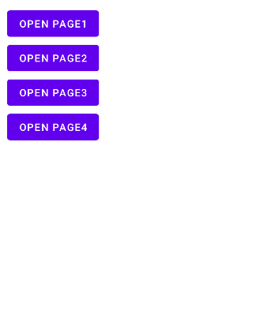
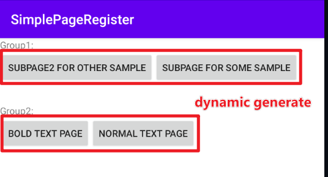

# 轻量级页面注册器

给页面快速注册用于demo展示的注入器。

过往的提供多个demo页面的方式是往绑定多个按钮，每个按钮处理点击跳转事件，过程较为繁琐臃肿，例如：



```kotlin
button1.setOnClickListener {
    startActivity(Intent(this@MainActivity, Page1::class.java))
}
button2.setOnClickListener {
    startActivity(Intent(this@MainActivity, Page2::class.java))
}
button3.setOnClickListener {
    startActivity(Intent(this@MainActivity, Page3::class.java))
}
button4.setOnClickListener {
    startActivity(Intent(this@MainActivity, Page4::class.java))
}
//....
```

如果你希望快速完成页面注册，而不是处理这些繁琐的事情，simple-page-register将会帮助你快速完成。



```kotlin
// Register your pages by loop, simple-page-register will help you collect the page 
DefaultHostPageRegister.getPages().forEach {
    binding.llSampleGroup1.addView(
        Button(this).apply {
            text = it.value // it.value is page description
            setOnClickListener { _->
                startActivity(Intent(this@MainActivity, it.key)) // it.key is page Class information
            }
        }
    )
}
```


